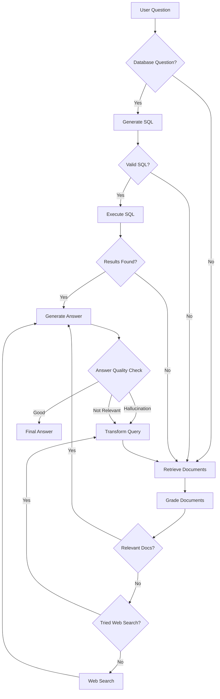

# RAG Workflow with Database Integration

## Demo Video
[](https://youtu.be/JmEAYjpwLP8)

Skip to 4:30 for frontend demo

## Quick Start
```bash
# Create and activate virtual environment
python -m venv .venv
source .venv/bin/activate  # On Windows: .venv\Scripts\activate

# Install dependencies
pip install -r requirements.txt

# Run the application
streamlit run app.py
```

This project implements a RAG (Retrieval-Augmented Generation) workflow with additional capabilities for querying an IPL (Indian Premier League) database and performing web searches when needed.

## Features

- **Document-based RAG**: Answers questions from PDF documents using vector store retrieval
- **IPL Database Integration**: Queries PostgreSQL database for cricket statistics
- **Web Search Fallback**: Performs web search when no relevant documents are found
- **Self-Reflection**: Evaluates answer quality and relevance
- **Query Transformation**: Rewrites questions to improve retrieval results
- **Fault Tolerance**: Gracefully handles database connection failures
- **Source Attribution**: Shows document sources with collapsible details
- **Interactive UI**: Clean Streamlit interface with progress tracking

## Architecture

The system uses a graph-based workflow with the following components:

1. **Document Processing**: Splits PDFs into chunks with source metadata
2. **Vector Store**: Stores document chunks for semantic retrieval
3. **Database Layer**: Connects to PostgreSQL for IPL cricket data
4. **Web Search**: Uses Tavily API for real-time information retrieval
5. **LLM Integration**: Uses OpenAI models for:
   - Query classification
   - SQL generation
   - Answer generation
   - Answer evaluation

## Workflow Flowchart



## Setup

### Prerequisites

- Python 3.8+
- PostgreSQL database
- OpenAI API key
- Tavily API key (for web search)

### Installation

1. Clone the repository
2. Create a virtual environment:
   ```
   python -m venv .venv
   source .venv/bin/activate  # On Windows: .venv\Scripts\activate
   ```
3. Install dependencies:
   ```
   pip install -r requirements.txt
   ```
4. Create a `.env` file with the following variables:
   ```
   # OpenAI API key
   OPENAI_API_KEY=your_openai_api_key

   # Tavily API key
   TAVILY_API_KEY=your_tavily_api_key
   
   # Database configuration (optional, defaults shown)
   DB_NAME=ipl_data
   DB_USER=postgres
   DB_PASSWORD=postgres
   DB_HOST=localhost
   DB_PORT=5432
   ```

### Database Setup

1. Make sure PostgreSQL is installed and running
2. Place your `deliveries.csv` file in the project root directory
3. The database will be automatically initialized when you run the application
4. If database connection fails, the app will continue running with document and web search only

## Usage

1. Start the application:
   ```
   streamlit run app.py
   ```
2. Enter your question in the text input field
3. Click "Get Answer" to process your question

## Question Types

The system can handle three types of questions:

1. **Document-based questions**: Questions about the content in your PDF documents
2. **IPL database questions**: Questions about cricket statistics (e.g., "How many runs did Virat Kohli score?")
3. **General questions**: Questions that may require web search for answers

## Workflow

1. **Database Check**: The system first checks if the question is related to the IPL database
2. **SQL Generation**: If it is database-related, it generates and executes a SQL query
3. **Document Retrieval**: If not database-related or if no database results, it retrieves relevant documents
4. **Document Grading**: Documents are evaluated for relevance to the question
5. **Web Search**: If no relevant documents are found, it performs a web search
6. **Answer Generation**: Generates an answer based on the available information
7. **Answer Evaluation**: The answer is evaluated for relevance, accuracy, and hallucinations
8. **Query Transformation**: If the answer is not satisfactory, the question is rewritten and the process repeats

## Fallback Mechanisms

The system includes multiple fallback mechanisms:

1. **Database Fallbacks**:
   - If database connection fails at startup, continues with document and web search
   - If database query execution fails, treats the question as non-database-related
   - If SQL generation fails, falls back to document retrieval

2. **Document Retrieval Fallbacks**:
   - If no relevant documents are found, falls back to web search
   - If web search fails, attempts query transformation

3. **Answer Generation Fallbacks**:
   - If the generated answer contains hallucinations, transforms the query and retries
   - If the answer doesn't address the question, transforms the query and retries

## Source Attribution

The system provides transparency about information sources:

1. **Database Sources**: Shows the SQL query used in a collapsible section
2. **PDF Sources**: Shows the document name and content in a collapsible section
3. **Web Search**: Indicates when web search was used to supplement the answer

## Authors

- **V. Meghanath Reddy** - *21119054*
- **Arpan Kumar** - *21322009*
- **S. S. H . Quadri** - *21119049*
